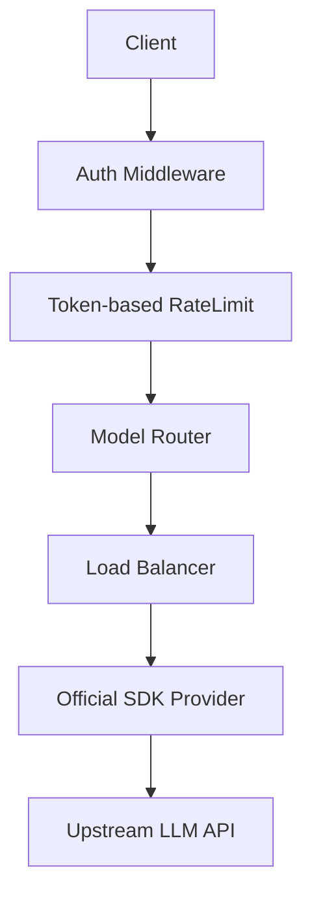

# OpenMux 架构设计

## 概述

OpenMux 是一个基于 Go 语言开发的高性能 LLM 代理服务，采用组件化设计，支持动态路由和多维度限流。

## 技术栈

- **Runtime**: Go 1.21+
- **LLM SDK**: [openai-go](https://github.com/openai/openai-go) (官方 SDK)
- **Tokenizer**: [tiktoken-go](https://github.com/pkoukk/tiktoken-go) (用于精准 Token 计算)
- **CI/CD**: GitHub Actions (支持多架构 Docker 镜像发布)

## 核心设计

### 1. 限流机制 (Rate Limiting)

OpenMux 实现了业内领先的 **"预留 (Reserve) + 修正 (Update)"** 限流算法：

1. **预留阶段**：请求到达时，系统使用 `tiktoken` 对 Prompt 进行编码计算 Token 数，并额外预留一小部分作为回复缓冲。此时会检查 TPM (Tokens Per Minute) 桶是否满足。
2. **执行阶段**：转发请求至 Provider。
3. **修正阶段**：请求完成后，从 Provider 返回的 `Usage` 数据中提取真实的 Total Tokens，并实时修正限流桶的计数（多退少补）。

### 2. Provider 层重构

通过引入官方 `openai-go` SDK，Provider 层大幅简化：
- **流式处理**：利用 SDK 的迭代器模式处理 SSE，确保了对复杂流式场景的兼容性。
- **错误映射**：SDK 提供了丰富的错误类型，方便网关进行重试决策（如 429 触发自动换 Key）。

### 3. 负载均衡与健康检查

- **Backend 抽象**：一个 Backend = Provider + API Key。
- **动态池**：每个 Provider 维护一个 Backend 池，支持跨 Key 的加权轮询。
- **主动避让**：当某个 Backend 返回限流或服务不可用错误时，自动标记为不健康，并在冷却期后重试。

## 模块拓扑

## 部署与扩展

- **Docker**: 支持 `linux/amd64` 和 `linux/arm64`。
- **扩展 Provider**: 遵循 `Provider` 接口即可快速接入非 OpenAI 协议的模型。